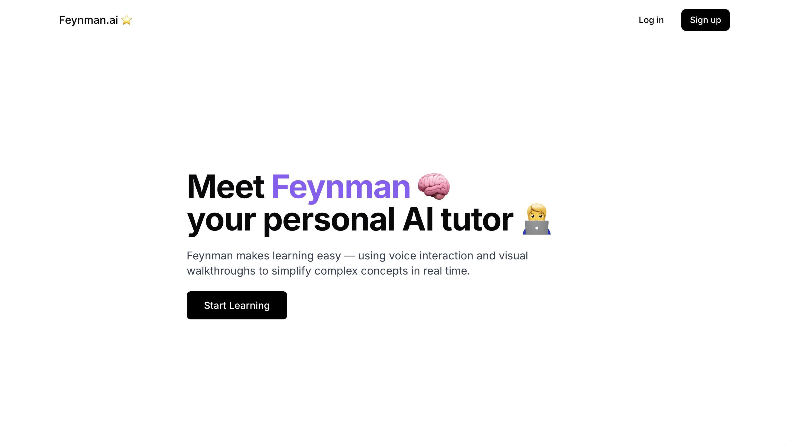
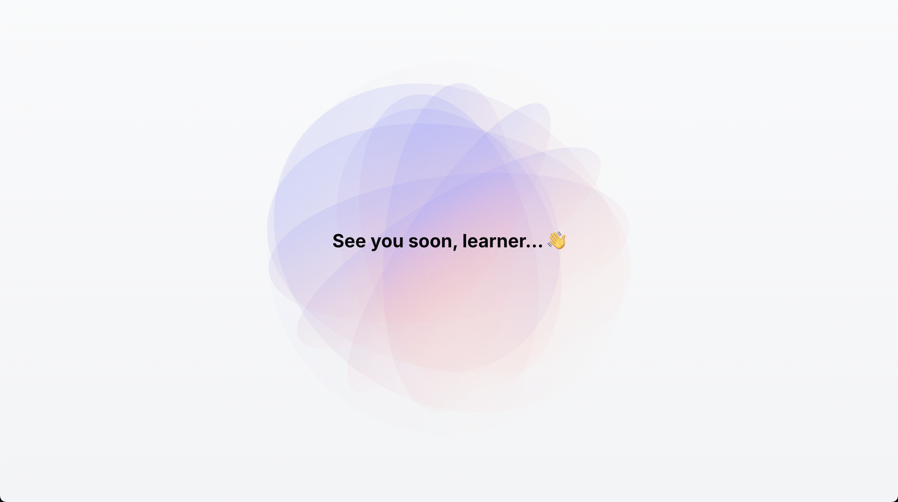
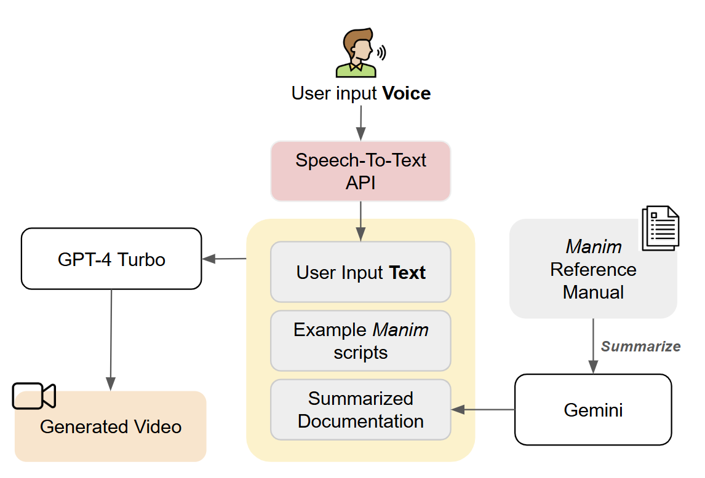

# Feynman AI

## Table of Contents

- [Feynman AI](#feynman-ai)
  - [Table of Contents](#table-of-contents)
  - [⚡️ Inspiration](#️-inspiration)
  - [❓ What It Does](#-what-it-does)
  - [🔨 How We Built It](#-how-we-built-it)
    - [Speech-To-Text](#speech-to-text)
    - [Video Generation](#video-generation)
  - [🪨 Challenges We Ran Into](#-challenges-we-ran-into)
    - [Slow \& Inaccurate Video Generation](#slow--inaccurate-video-generation)
    - [Complex System Integration](#complex-system-integration)
  - [🏆 Accomplishments that We're Proud of](#-accomplishments-that-were-proud-of)
  - [🤔 What Did We Learn?](#-what-did-we-learn)
  - [:exclamation: What's Next for Feynman.ai??](#exclamation-whats-next-for-feynmanai)
  - [Architecture](#architecture)
  
 
 

A hackathon project built for [GenAI Genesis 2025](https://devpost.com/submit-to/24315-genai-genesis-2025/manage/submissions/633897-feynman-ai/finalization).

## ⚡️ Inspiration
Feynman.ai was born from a **deeply personal reflection**: the realization that education, in many parts of the world, often prioritizes performance over curiosity — and that this imbalance can have lasting consequences. For the majority of our team members, growing up in a system where grades mattered more than genuine understanding sparked a desire to reimagine what learning could be. At the same time, we witnessed first-hand how a lack of access to education can perpetuate cycles of inequality.

That experience planted a question at the heart of our work:

*What if education could be more than a system?*

*What if it could be something that excites people and levels the playing field?*

Feynman.ai is our answer to that question. Inspired by Richard Feynman — Nobel laureate and one of the greatest teachers of the 20th century — Feynman AI makes high-quality, personalized learning accessible to anyone, anywhere. Our goal isn’t just to help students pass exams, but to foster deeper understanding, spark creativity, and build resilience.

Feynman.ai is more than a platform — it’s a belief that **education should be a right, not a privilege**. And that **real learning should not just answer questions, but inspire better ones.**

## ❓ What It Does
Feynman is an AI-powered chatbot that guides math learners through step-by-step, personalized explanations — just like a real tutor would. Feynman can:
- **Understand User Questions** - whether typed or spoken 
- **Respond with Voice and Ask Follow-Up Questions** - making learning engaging 
- **Visualize Concepts on a Lecture Board** - just like a real tutor would
Feynman aims to make education more accessible, equitable, and empowering. We want to help achieve the **UN SDGs 4 (Quality Education), and 10 (Reduced Inequalities).**

## 🔨 How We Built It
For our product to be helpful to learners, we focused on delivering a **real-time and interactive experience** between the user and the chatbot. 

### Speech-To-Text
We wanted the user actually having a REAL conversation with Feynman.ai. So we adapted Speech-to-text API from Google TTS to make user interactions with the AI tutor more interactive! 

### Video Generation 
To minimize the delay between user queries and lecture video generation, we explored various research papers and consulted with multiple mentors. Ultimately, we adopted a combination of *few-shot learning* and *instruction tuning*. 
For few-shot prompting, we curated the example python scripts from the official Manim Community, then we provided them to the model as references. Additionally, we supplied the model with a **Reference manual**—a summarized version of module, function, and variable documentation (up to ~1 million tokens)—generated using **OpenAI**.  To further speed up video generation, we reduced the output resolution from the default 1080p to 480p.

###Animated Tutor
To make Feynman more interactive, the character was animated using individual facial expressions for various phonetic mouth shapes (e.g., mouth open for sound "O").

## 🪨 Challenges We Ran Into
### Slow & Inaccurate Video Generation 
  The primary challenge was ensuring that video generation was fast enough to support *real-time* interactions. However, the initial video rending process was too slow. Also, generated script was not accurate, causing errors when rendering with the Manim library.  To tackle this, we researched different optimization techniques in academic papers, experimented with different models and prompt designs. We discovered that script accuracy significantly improved when we provided the model with example Manim scripts and crafted more detailed instructions that closely aligned with Manim’s syntax—while also emphasizing the importance of maintaining user interaction.

### Complex System Integration
 We used several different APIs and tools, including speech-to-text to understand the user's input and Manim library to generate math lecture visuals. Manim also offers the plugin called *Voiceover* which can add voiceovers to Manim videos directly in Python without having to use a video editor, or other Text-to-speech APIs.
It was a huge technical challenge for us to manage the complex dependencies within the Manim container and coordinating all components into a smooth, cohesive pipeline.

## 🏆 Accomplishments that We're Proud of
We came into the competition being ambitious, hoping to build something that is impactful and innovative, whilst have fun doing it. However, the whole process was very hard. We're proud of our teamwork and support for each other, and happy that we were able to build a functioning MVP that we could show everyone. 

## 🤔 What Did We Learn? 
We've learnt *a lot*.
- We gained so much experience working with **LLMs, prompt engineering, data handling, Docker** 
- We even got to explore **Manim, a python-based script to math visualization tool** (shoutout 3blue1brown, the creator of the programming language!) 
- We explored various LLM techniques **such as few-shot learning and instruction tuning**
- We utilized different LLMs and explored their advantages and disadvantages.
- We played with different animations for the front-end, whilst trying out many different designs and 'vibes'! 
—and to push through suffering and the limits of being human.

## :exclamation: What's Next for Feynman.ai??
Currently, Feynman can only solve basic math questions accurately and quickly. Our next focus is to allow the AI to **answer harder questions, whilst reducing latency in video generation** through more optimized prompting and structures. We are planning to split questions into different concepts and generating videos step by step! 

We're also enhancing Feynman's ability to **engage in deeper, more adaptive dialogue**. By building a contextual memory system, Feynman will recall what each learner has asked and tailor follow-up explanations according. This will enable more personalized and meaningful interactions. 

On the animation side, we’re refining our lip-syncing pipeline using phoneme-to-viseme mapping to achieve **smoother, more accurate facial expressions**. This makes Feynman feel not just intelligent, but alive — with presence and empathy.

We’re also working toward **multilingual support** using multilingual LLMs and open speech datasets, making Feynman accessible to a wider global audience. This is essential to our commitment to UN SDGs 4 (Quality Education) and SDG 10 (Reduced Inequalities).

## Architecture
- **Frontend:** React, TypeScript, TailwindCSS
- **Backend:** Python
- **AI Models:** Integrated with OpenAI GPT4 Turbo, Gemini 1.5 & 2.0 Flash, 
- **Containerization:** Dockerized for easy and consistent deployment

